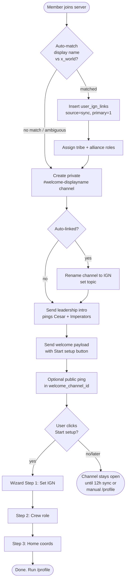
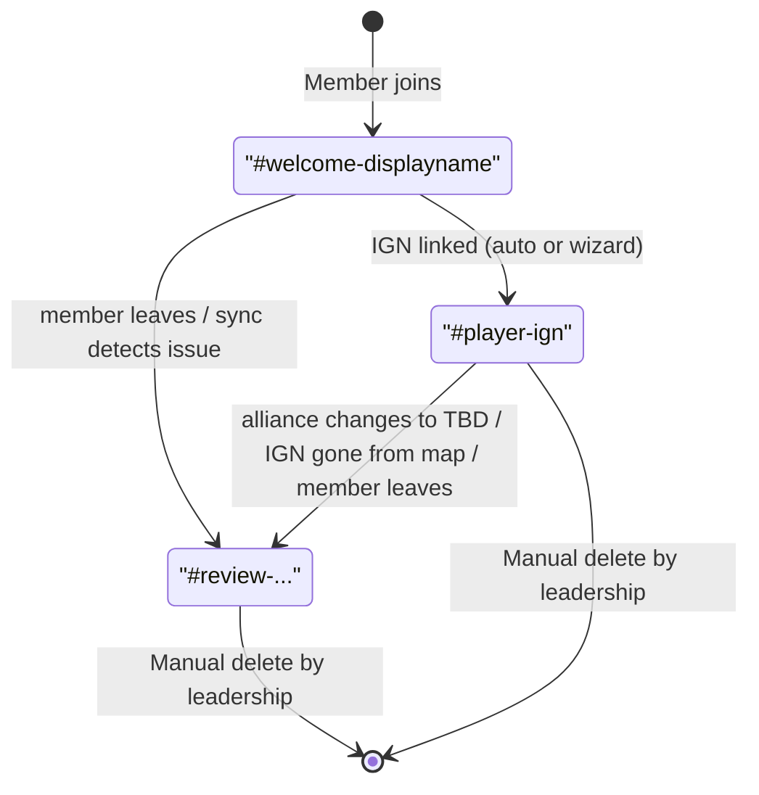

# Onboarding

How new members join the alliance Discord, get their Travian account linked, and pick up the right roles.

## TL;DR

When someone joins the server:

1. A **private `#welcome-<name>` channel** is created — only the new member and leadership (`Cesar`, `Imperators`) can see it.
2. The bot tries to **auto-match** the member's display name against current Travian map data.
3. **If matched** → IGN linked, tribe + alliance roles assigned, channel renamed to the IGN, leadership pinged.
4. **If not** → leadership pinged anyway, member runs through a **3-step wizard** (IGN → crew role → home coords).
5. **Every 12h** the member sync job re-checks all linked members, refreshes roles, and flags channels for review on changes.

---

## End-to-end flow

```
Member joins the server
        │
        ▼
┌───────────────────────────────────────────────────────────┐
│  Auto-match: normalize displayName vs x_world.player      │
└───────────────────────────────────────────────────────────┘
        │
        ├── matched ────────► link (source=sync, primary=1)
        │                          │
        │                          ▼
        │                    assign tribe + alliance roles
        │                          │
        └── no match / ambiguous   │
                │                  │
                └─────────┬────────┘
                          │
                          ▼
            Create private #welcome-<displayname> channel
            (only if onboarding_category_id is set)
                          │
              ┌───────────┴───────────┐
              │                       │
       auto-linked? yes        auto-linked? no
              │                       │
              ▼                       │
   rename channel to <ign>            │
   + set topic                        │
              │                       │
              └───────────┬───────────┘
                          ▼
            Send leadership intro
            (pings Cesar + Imperators)
                          │
                          ▼
            Send welcome payload
            with "🚀 Start setup" button
                          │
                          ▼
        Optional public ping in welcome_channel_id
                          │
                          ▼
            User clicks "🚀 Start setup"?
                          │
              ┌───────────┴───────────┐
              │                       │
             yes                   no / later
              │                       │
              ▼                       ▼
      Wizard Step 1 (IGN)     Channel stays open
              │               until 12h sync, or
              ▼               manual /profile
      Step 2 (crew role)
              │
              ▼
      Step 3 (home coords)
              │
              ▼
           Done.
```

<details>
<summary>View as Mermaid diagram (renders on GitHub)</summary>



</details>

## The wizard

After auto-match (or not), the welcome message in the private channel has a **🚀 Start setup** button. Clicking it starts a 3-step ephemeral wizard. Steps the bot can already see as satisfied are skipped automatically — `getNextStep()` in [src/handlers/onboarding.js](src/handlers/onboarding.js) computes the next missing piece.

### Step 1 — Set IGN

- Opens a modal asking for the exact Travian name (case-insensitive lookup).
- Validates against `x_world.player`. Three outcomes:
  - **Found uniquely** → creates a `travian_accounts` row, `user_ign_links` row with `source='self'`, `is_primary=1`, calls `assignRolesFromIgn()`, renames channel + updates topic.
  - **Not found** → friendly error, no link created.
  - **Ambiguous** (multiple players share the name) → asks user to ping an admin to use `/admin link`.

### Step 2 — Crew role

- Five buttons, one per role from [`ROLE_SELECTIONS`](src/utils/roleSelection.js): `🛡 Defense`, `⚔️ Offense`, `🔄 Hybrid`, `🔭 Scout`, `📦 Resources`.
- Picking a role updates the member's Discord roles (removes other crew roles, adds the picked one). Same logic as the `/setup roles` panel.
- After the pick, click **Continue ➡** to advance.

### Step 3 — Home coords

- Opens a modal asking for coords like `-12|34`.
- Validates that the village exists in `x_world`, isn't Nature/Natars (`tid=4,5`), and **belongs to the linked IGN**.
- On success: stores coords in `travian_accounts`, derives tribe from `x_world.tid`, assigns the matching tribe role.

---

## Channel lifecycle

```
   ┌──────────────────────┐
   │ #welcome-<display>   │   created on join
   └──────────┬───────────┘
              │
              │   IGN linked (auto-match on join,
              │   or wizard Step 1, or admin /link,
              │   or sync job link)
              ▼
   ┌──────────────────────┐
   │ #<player-ign>        │   renamed when IGN is set
   └──────────┬───────────┘
              │
              │   member leaves          OR
              │   alliance role → TBD    OR
              │   IGN gone from x_world
              ▼
   ┌──────────────────────┐
   │ #review-<previous>   │   flagged for leadership review
   └──────────┬───────────┘
              │
              │   manual cleanup by Cesar / Imperators
              ▼
           (deleted)

   Channels are never auto-deleted.
   Leadership controls every removal.
```

<details>
<summary>View as Mermaid diagram (renders on GitHub)</summary>



</details>

The channel is **never auto-deleted** — channels are flagged for leadership review instead. This avoids losing chat history if someone re-joins or had legitimate alliance churn.

Names are sanitized: lowercased, non-alphanumerics → `-`, trimmed to 100 chars (90 for the `welcome-` prefix variant, 93 for the `review-` prefix).

---

## Auto-match logic

[src/utils/memberMapMonitor.js](src/utils/memberMapMonitor.js) → `matchMemberToPlayer`.

Both the Discord display name and every `x_world.player` value are normalized: NFKD-decomposed, diacritics stripped, lowercased, non-letter/non-digit characters removed.

A match exists when the normalized member name **contains** the normalized player name as a substring. Players are scored by longest-normalized-name first, then by population, then alphabetically. If the longest tier has more than one player, the result is **ambiguous** — no auto-link.

This means `LeJohn-T` (Discord) matches `LeJohn` (map) without manual intervention, but `Mike` (Discord) when there are three players named `Mike` will be left for the wizard or `/admin link`.

---

## Periodic sync interactions

The 12-hourly **member sync job** ([AUTOMATIONS.md](AUTOMATIONS.md)) interacts with onboarding in several ways:

| Sync detects                                  | Action                                                                          |
|-----------------------------------------------|---------------------------------------------------------------------------------|
| New auto-matchable member (no existing link)  | Same as join: link, assign roles, **rename onboarding channel** to the IGN     |
| Existing linked member, alliance role changed | Re-assign role; if new role is `TBD`, **flag channel** + list in embed under **⚠️ Newly Flagged (moved to TBD)** |
| Existing linked member, IGN gone from x\_world | **Flag channel** + list under **⚠️ Newly Flagged (IGN missing from map)** — skip role assignment |
| Member with `TBD` role but no IGN link        | List under **🚨 Unlinked TBDs** so leadership can `/admin link` or `/admin sync-exclude` them |
| Excluded member (`/admin sync-exclude`)       | Skipped entirely — never auto-linked, never flagged                            |

All four lists appear with `@`-mentions in both `/admin sync-members` and the scheduled cron notification, so leadership has full visibility into who needs attention.

The sync ignores members in `sync_exclusions` so leadership, sitters, or out-of-alliance test accounts don't get processed.

---

## Leadership notifications

`buildLeadershipMentions(guild)` in [src/handlers/onboarding.js](src/handlers/onboarding.js#L371) walks the `Cesar` and `Imperators` Discord roles, dedupes members across both, and returns a `<@user_id>` mention string + the matching ID list (used as `allowedMentions.users` so the pings always fire even if the channel suppresses role pings).

Used in two places:

1. **On join** — `sendLeadershipIntro()` posts the new member's name and (if matched) their IGN.
2. **On flag** — `flagOnboardingChannel()` posts `⚠️ Action required — <reason>` with the leadership mention.

---

## Configuration

All set via slash commands; stored in the `config` table.

| Config key                | Set via                                  | Required? | Used for                                          |
|---------------------------|------------------------------------------|-----------|---------------------------------------------------|
| `onboarding_category_id`  | `/admin set-onboarding-category`         | Required for private channels — without it, no `#welcome-<name>` channel is created | Parent category for per-member channels |
| `welcome_channel_id`      | `/admin set-welcome-channel`             | Optional  | Brief public ping when a member joins              |
| `notifications_channel_id`| `/admin set-notifications-channel`       | Optional  | Sync summary embeds                               |

Roles the bot expects to find by name (case-sensitive):

| Role           | Purpose                                                                |
|----------------|------------------------------------------------------------------------|
| `Cesar`        | Leadership — gets channel perms + intro / flag pings                   |
| `Imperators`   | Leadership — same as above                                             |
| `Accepted`     | Awarded when a member's IGN is in the configured alliance              |
| `TBD`          | Awarded instead of `Accepted` when the IGN is out of the alliance      |
| `Roman` / `Teuton` / `Gaul` / `Egyptian` / `Hun` / `Spartan` | Tribe roles assigned from `x_world.tid` |
| Crew roles     | See [src/utils/roleSelection.js](src/utils/roleSelection.js)            |

---

## Admin commands

| Command                          | What it does                                                              |
|----------------------------------|---------------------------------------------------------------------------|
| `/admin link @user ign`          | Manually link a Discord user to an IGN (as a **secondary** link)         |
| `/admin unlink @user ign`        | Remove a link; promotes the oldest remaining link to primary if needed   |
| `/admin set-primary @user ign`   | Flip which of a user's linked IGNs is primary                            |
| `/admin set-coords @user coords` | Set the home village coords for a user; auto-derives tribe + role        |
| `/admin check @user`             | Inspect a user's linked IGN, current map alliance, and roles they'd get  |
| `/admin map-search ign`          | Direct map lookup — alliance / tribe / villages / Accepted/TBD verdict   |
| `/admin sync-members`            | Run the member sync immediately (instead of waiting for the 12h cron)    |
| `/admin sync-exclude @user`      | Add a member to the auto-sync skip list                                   |
| `/admin sync-unexclude @user`    | Remove from the skip list                                                 |
| `/admin sync-excluded-list`      | List everyone currently skipped                                           |
| `/admin onboarding-status`       | List members with incomplete onboarding (missing IGN / crew role / coords) |

---

## Edge cases

- **No `onboarding_category_id` set** — the bot still pings the public welcome channel (if configured) and runs the wizard via `/profile`, just without a dedicated private space.
- **Bot lacks `Manage Channels`** — channel create fails, logged at `error` level, member still gets the public welcome ping if configured.
- **Auto-match is ambiguous** — no link is created. The wizard's Step 1 will also reject ambiguous input and route to `/admin link`.
- **Member changes their Discord nickname after joining** — re-running `/admin sync-members` won't pick them up unless their new name happens to match (the normalization is `display name contains IGN`, not the other way around). For these, `/admin link` is the canonical fix.
- **Member leaves then rejoins** — channel was flagged on leave (`#review-...`). `handleGuildMemberAdd` will create a **new** `#welcome-<name>` channel; the old `#review-...` one stays around for leadership to clean up manually. Old `user_ign_links` rows remain unless explicitly unlinked.
- **A linked member's IGN disappears from the map** (account deleted) — sync flags the channel; role assignment is skipped (the IGN can't be looked up). They keep their old tribe + alliance roles until leadership manually unlinks.

---

## Where the code lives

| Concern                                 | File                                                                |
|-----------------------------------------|---------------------------------------------------------------------|
| Join handler, wizard, channel mgmt      | [src/handlers/onboarding.js](src/handlers/onboarding.js)            |
| IGN link DB operations                  | [src/handlers/userIgnLinks.js](src/handlers/userIgnLinks.js)        |
| Tribe + alliance role assignment        | [src/handlers/memberRoles.js](src/handlers/memberRoles.js)          |
| travian\_accounts CRUD                  | [src/handlers/travianAccounts.js](src/handlers/travianAccounts.js)  |
| Auto-match scoring                      | [src/utils/memberMapMonitor.js](src/utils/memberMapMonitor.js)      |
| Crew role definitions                   | [src/utils/roleSelection.js](src/utils/roleSelection.js)            |
| Conflict / ambiguity resolution flow    | [src/handlers/syncResolve.js](src/handlers/syncResolve.js)          |
| Admin slash commands                    | [src/commands/admin.js](src/commands/admin.js)                      |
| Periodic sync (renames + flags)         | [src/jobs/memberSync.js](src/jobs/memberSync.js)                    |
